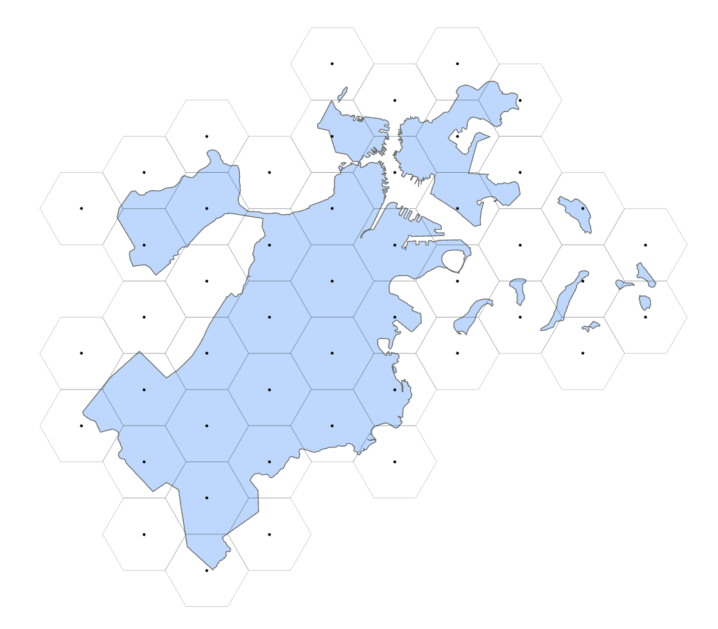
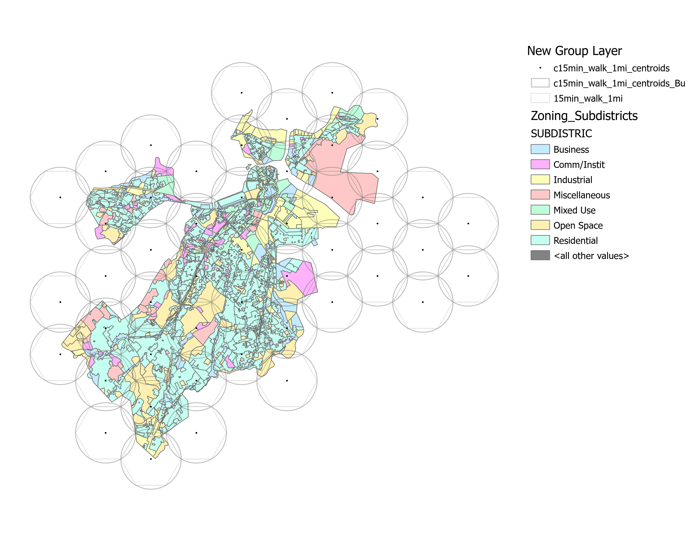
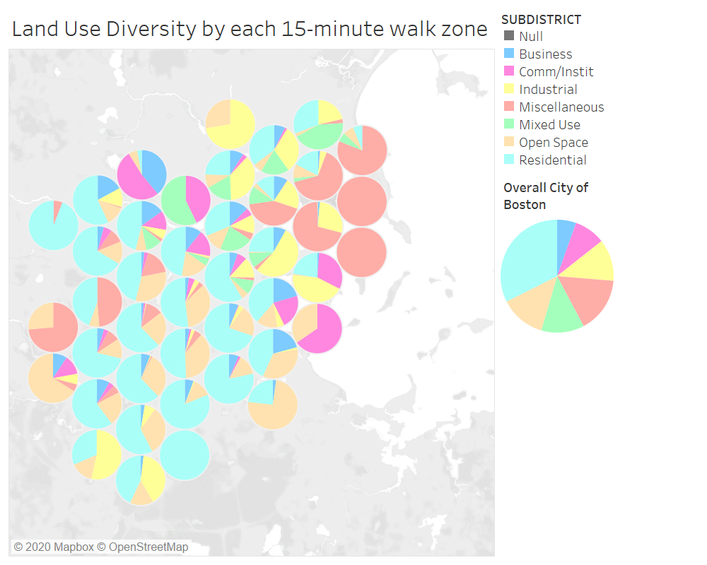

# 15 Minute Boston

As espoused by the Mayor of Paris Anne Hidalgo, the '15 minute city' requires that all basic daily necessities including schools, places of work, public institutions, parks, groceries,  restaurants, entertainment should be no more than a 15 minute walk, bike, or transit ride from a person's home. 

Understandably, Boston's current configuration does not allow for such a situation. Furthermore, a 15 minute walk is significantly shorter than a 15 minute bike ride, and generally speaking public transit will take you further than a bike in 15 minutes.

In what ways would Boston's land-use configuration have to change, to accomodate these requirements? Does it really make sense to concentrate all businesses in one centralized 'downtown' area or Financial District? 

### 15 Minute Walk Zones

By generating hexagonal tesselations of side equal to 1 mile (the generally accepted distance an average person can walk in 15 minutes) we divide the City of Boston into zones equalling a 1 mile radius. Since the radius of 1 mile is equal to the side of the hexagon, the circumscribed radius is also equal to 1 mile. This effectively creates (for each 1-mile hexagon) up to 6 overlapping zones with neighboring hexagons.

1 mile radius hexagons | 1 mile radius overlapping circles
:--:|:--:
 | 

Working with the existing urban layout and physical infrastructure, how do we ensure that all the above mentioned services can be made available within this 1-mile zone?
We mapped these two layers together: by getting the proportion of land covered under each major use type, how does each zone compare to the city-wide average?

Land Use for Boston City | Land use proportions
:--:|:--------------------:
|  [_see data on Tableau Public_](https://public.tableau.com/profile/aseem.deodhar#!/vizhome/LandUseDiversityinBoston/Dashboard1)

What policy, design and planning changes can be made to transform each zone into a self-sustaining 15-minute walk zone?
