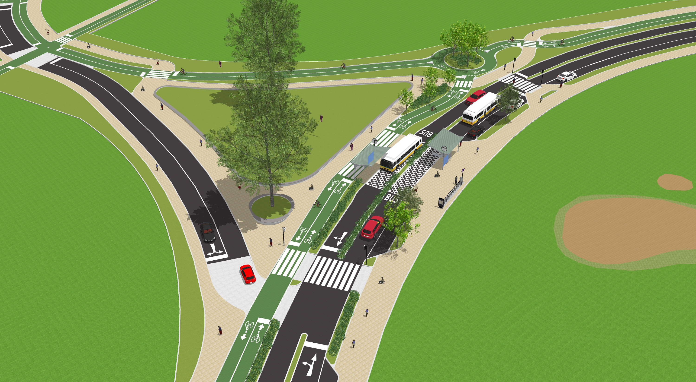

# Sketchup Images

As we had determined from our analysis of Boston's sidewalks, we found four key situations:

* **Low Density & High Sidewalk width**
  + *Example areas:* Franklin Park, Boston Common
  
* **High Density & Low Sidewalk width**
  + *Example areas:* Financial District, Longwood Medical Center

* **Low Density & Low Sidewalk width**
  + *Example areas:* Roslindale, West Roxbury (generally primarily residential areas)

* **High Density & High Sidewalk width**
  + *Example areas:* Copley Square, Back Bay
  
 | Density | Sidewalk Width | Example Locality | Current View | Proposed View |
 |:-------:|:--------------:|:-----------------|:------------:|:-------------:|
 |High|High|Copley Square, Back Bay|||
 |Low|Low|Roslindale, West Roxbury|||
 |Low|High|Franklin Park, Boston Common|||
 |High|Low|Financial District. Longwood Medical Center||![](oldstatehouse_1_new.jpg|
